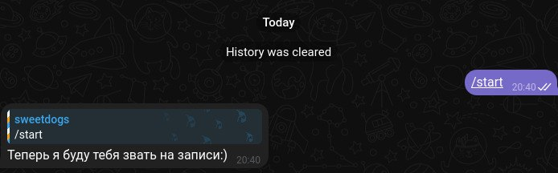
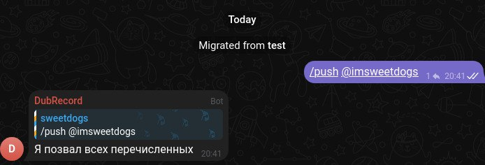
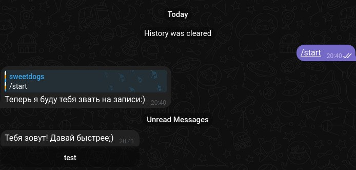

# DublyajnayaRecord

## 1. Для чего

Этот бот помогает быстро оповестить участников группы о том, что открыта запись на релиз. Он автоматически отправляет личные сообщения тем, кого был упомянут в чате, с приглашением присоединиться. Это стало нужным так как один релиз/тайтл - один чат, в итоге всё превращается в мусорку, а так можно иметь хотя бы очередь задач.

## 2. Как это работает

1. Вы добавляете бота в группу Telegram (основной никнейм @dublyajnaya_bot). 
2. Даёте ему права администратора. Нужно для того, чтоб он мог получать id пользователей и писать им
3. В группе пишете сообщение с упоминаниями нужных участников (например, `@user1 @user2`). В ЛЮБОМ ФОРМАТЕ, он реагирует вообще на любые упоминания, это конечно немного неправильно и требует доработки. Например отключение таких упоминаний для определённого чата.
4. Бот находит всех упомянутых, создает ссылку-приглашение в чат и отправляет им личное сообщение с кнопкой для быстрого перехода (Они должны предварительно открыть чат с ботом, чтоб он мог им писать).
5. После рассылки бот сообщает в чате, что все оповещены.

### Важно: разница между webhook и polling

**Webhook** — это когда Telegram сам присылает вашему боту новые сообщения по специальному адресу (нужен внешний сервер с HTTPS, например, сайт или облако). Сообщения приходят мгновенно, бот всегда на связи.

**Polling** — это когда бот сам каждые несколько секунд спрашивает у Telegram: «Есть что новенького?». Можно запускать даже на домашнем компьютере, сервер не нужен, но сообщения иногда приходят с небольшой задержкой.

Если не знаете, что выбрать — используйте polling, так проще для новичков. Webhook нужен для продвинутого и стабильного запуска на сервере.

## 3. Примеры работы

**Пример сообщения в группе:**
```
@user1 @user2 запись на релиз открыта!
```

**Бот отправляет личные сообщения:**
> Тебя зовут! Давай быстрее ;)
> [Кнопка с названием чата и ссылкой]

Думаю стоит добавить ещё упоминания кто позвал, но пока задача подключить базу данных для простого создания списка команд, так как они скорее всего часто в +- одном составе.

**Ответ в группе:**
> Я позвал всех перечисленных

_Место для скриншотов:_





Команда /push не является обязательной, скриншоты с момента тестирования.

## 4. Как развернуть у себя

### Шаг 1. Получите токен Telegram-бота
1. Откройте Telegram и найдите @BotFather
2. Создайте нового бота командой `/newbot` и следуйте инструкциям
3. Скопируйте токен, который даст BotFather

### Шаг 2. Получите api_id и api_hash
1. Перейдите на https://my.telegram.org
2. Войдите под своим номером
3. Перейдите в раздел API development tools
4. Создайте приложение и скопируйте `api_id` и `api_hash`

ИМЕЙТЕ ВВИДУ ИХ НУЖНО ОЧЕНЬ СИЛЬНО БЕРЕЧЬ И НЕ РАССКРЫВАТЬ. ОНИ УЖЕ ЧУВСТВИТЕЛЬНЫ И С НИМИ МОГУТ УГНАТЬ ВАШ АККАУНТ ТЕЛЕГРАММ!!!

### Шаг 3. Настройте переменные окружения
Создайте файл `.env` в корне проекта и добавьте:
```
tg_token=ВАШ_ТОКЕН_БОТА
tg_api_id=ВАШ_API_ID
tg_api_hash=ВАШ_API_HASH
app_mode=polling
# Если хотите использовать webhook:
# app_mode=webhook
# app_host=https://ВАШ_ДОМЕН
# app_port=8000
```

### Шаг 4. Установите uv
Скачайте себе на python uv менеджер зависимостей.

### Шаг 5. Установите зависимости
Откройте терминал в папке проекта и выполните:
```
uv sync
# Если используете вебхуки
uv sync --all-extra web
```

### Шаг 5. Запустите бота
В терминале выполните:
```
uv run start
```

Если всё сделано правильно — бот заработает! Если возникнут вопросы, пишите разработчику или смотрите примеры выше.
